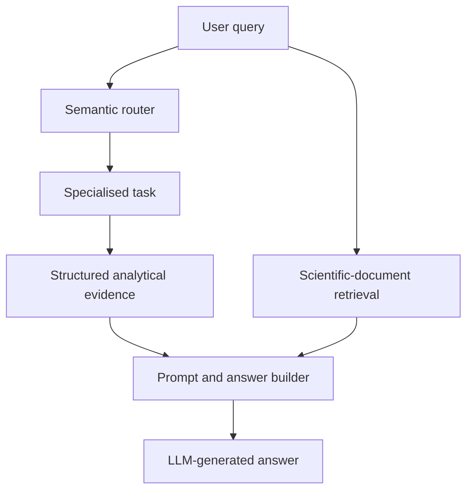

# EcosystemDigitalTwin

A modular, conversational **Digital Twin of an Ecosystem (DTE)** that connects harmonised geospatial data, updated observations, scientific documents, ecological models, and large language models (LLMs).

The framework follows a **reactive architecture**: a user's query is first routed to a specialised analytical module, which produces structured evidence. An LLM then combines this evidence with relevant scientific context and communicates the result in natural language. This separation keeps numerical analysis outside the LLM and makes the origin of each answer easier to inspect.

The repository currently includes a configured implementation for the **Massaciuccoli Lake basin** in Tuscany, Italy. The same framework can be adapted to another ecosystem by replacing the datasets, documents, study-area geometry, prompts, and ecosystem-specific models.

> **Research software notice:** outputs are model-based scientific information, not automatically validated management decisions. Results should be interpreted with their assumptions, uncertainty, data coverage, and model limitations, particularly when used to support environmental policy or intervention.

## Main capabilities

- Semantic classification and routing of natural-language queries.
- Retrieval of updated environmental observations.
- Identification of conditions characterising high-risk ecosystem areas.
- Statistical analysis of relationships among ecosystem stressors.
- On-demand species habitat modelling using GBIF occurrences and MaxEnt.
- Projection of ecosystem risk under hypothetical stressor changes.
- Comparison of alternative environmental or conservation scenarios.
- Retrieval-augmented generation using ecosystem-specific scientific documents.
- Configurable agent behaviour, prompts, models, thresholds, and study area.
- Local execution with Ollama, ChromaDB, Java, and open-source analytical libraries.

## Architecture



The router embeds the incoming query and compares it with curated examples for every supported category. The category with the highest cosine similarity activates the corresponding task. If no specialised category exceeds the configured fallback score, the query is handled as general conversation.

### Supported query categories

| Category | Main implementation | Purpose |
|---|---|---|
| Conversation | `ChatTask` | Handles greetings, clarification requests, and unsupported or general questions. |
| Data retrieval | `DataTask` | Reports available or updated observations from the live dataset. |
| Stressor correlations | `CorrelationTask`, `CorrelationModel` | Quantifies associations between a source variable and one or more target variables. |
| Ecosystem drivers | `RiskImportanceTask`, `StatisticalExplainer` | Identifies ecosystem features characterising areas classified as high risk. |
| Scenario projection | `RiskVariationTask`, `RandomForestModel` | Estimates changes in high-risk cells after modifying one or more stressors. |
| Scenario comparison | `RiskComparisonTask` | Compares two alternative environmental or conservation scenarios against a common baseline. |
| Species habitat | `ENMTask`, `ENMManager`, `SpatialAnalysis` | Builds an on-demand MaxEnt model and reports habitat coverage, fragmentation, connectivity, structure, predictor contributions, and model quality. |

## Requirements

- **Java Development Kit 21**
- **Eclipse IDE** with Maven support, or Apache Maven 3.9+ after declaring the bundled MaxEnt JAR as described below
- **Docker** for the supplied Ollama and ChromaDB setup
- Internet access for configured remote datasets and GBIF services
- Sufficient memory for the selected LLM and ecosystem dataset
- An NVIDIA GPU and NVIDIA Container Toolkit are optional but recommended for faster local LLM inference

The Java dependencies declared in `pom.xml` include Jackson, Apache PDFBox, Apache Commons CSV, and Weka. The MaxEnt implementation is supplied in `libs/max_ent_cyb.jar`.

## Quick start

### 1. Clone the repository

```bash
git clone https://github.com/cybprojects65/EcosystemDigitalTwin.git
cd EcosystemDigitalTwin
```

### 2. Start Ollama

With an NVIDIA GPU:

```bash
docker run -d --gpus=all \
  -v ollama:/root/.ollama \
  -p 11434:11434 \
  --name ollamadto \
  ollama/ollama
```

Without GPU passthrough, omit `--gpus=all`:

```bash
docker run -d \
  -v ollama:/root/.ollama \
  -p 11434:11434 \
  --name ollamadto \
  ollama/ollama
```

Download the default language and embedding models:

```bash
docker exec ollamadto ollama pull llama3.2
docker exec ollamadto ollama pull nomic-embed-text
```

Alternative Ollama models can be selected through `configuration/config.properties`, provided that they are available to the configured Ollama service.

### 3. Start ChromaDB

The application expects ChromaDB at `http://localhost:8000`. From the repository root, start the supplied version and mount the `pdfs` directory as persistent storage.

Linux or macOS:

```bash
docker run -d \
  --name chromadb \
  -p 8000:8000 \
  -v "$(pwd)/pdfs:/data" \
  chromadb/chroma:1.5.3
```

Windows PowerShell:

```powershell
docker run -d `
  --name chromadb `
  -p 8000:8000 `
  -v "${PWD}/pdfs:/data" `
  chromadb/chroma:1.5.3
```

At first use, the application can create the `pdf_documents` collection from PDF files in `pdfs/`. Documents are converted to text, divided into chunks of at most 1,200 characters, embedded with the configured embedding model, and indexed in ChromaDB. If the collection already exists, ingestion is skipped.

### 4. Review the configuration

Edit:

```text
configuration/config.properties
```

At minimum, verify:

- `llm_address`, `llm_model`, and `llm_token`;
- `embedder_address` and `embedder_model_name`;
- `knowledge_base_data`;
- `live_update_data`;
- `longitude_column`, `latitude_column`, and `risk_column`;
- `area_polygon` and `gbif_max_samples`;
- RAG and routing thresholds;
- paths to query examples and prompt templates.

Do not commit private access tokens or restricted data URLs.

### 5. Compile and run the command-line chatbot

The current repository registers `libs/max_ent_cyb.jar` in Eclipse's `.classpath`. The direct, unmodified setup is therefore:

1. Import the repository into Eclipse using **File > Import > Existing Maven Projects**.
2. Select a Java 21 JDK for the project.
3. Verify that `libs/max_ent_cyb.jar` appears on the build path.
4. Run `it.cnr.ncss.orchestrator.DTEChatterbot` as a Java application.

For a Maven-only build, first install the bundled JAR in the local Maven repository:

```bash
mvn install:install-file \
  -Dfile=libs/max_ent_cyb.jar \
  -DgroupId=org.gcube.datanalysis \
  -DartifactId=max-ent-cyb \
  -Dversion=1.0-local \
  -Dpackaging=jar
```

Then add the corresponding dependency to `pom.xml`:

```xml
<dependency>
  <groupId>org.gcube.datanalysis</groupId>
  <artifactId>max-ent-cyb</artifactId>
  <version>1.0-local</version>
</dependency>
```

The application can then be compiled and launched from the repository root:

```bash
mvn clean compile
mvn exec:java -Dexec.mainClass=it.cnr.ncss.orchestrator.DTEChatterbot
```

Enter a natural-language question at the prompt. Type `exit` to stop the session.

Example questions:

```text
Which environmental variables are currently available?
What factors correlate with biodiversity?
Which conditions characterise high-risk areas?
Is the habitat of the kingfisher fragmented or well connected?
How would ecosystem risk change if tree cover decreased by 30%?
Which scenario is worse: increasing temperature or decreasing precipitation?
```

The core application can also be embedded in another service by instantiating `DigitalTwin` and calling:

```java
DigitalTwin twin = new DigitalTwin();
String answer = twin.manageRequest(userQuery);
```

## Configuration reference

| Property group | Purpose |
|---|---|
| `llm_*`, `num_ctx`, `num_predict`, `temperature`, `top_p` | LLM endpoint, model, authentication, and generation parameters. |
| `embedder_*` | Embedding endpoint and model used for routing, feature matching, and document retrieval. |
| `knowledge_base_data` | Path to the harmonised ecosystem dataset. |
| `live_update_data` | URL of the periodically updated live dataset. |
| `longitude_column`, `latitude_column` | Coordinate fields in the ecosystem dataset. |
| `risk_column` and risk labels | Baseline ecosystem-risk target and class configuration. |
| `area_polygon` | Study-area boundary in Well-Known Text polygon format, used for spatial retrieval. |
| `gbif_max_samples` | Maximum number of GBIF occurrence records used in an on-demand habitat model. |
| `top_k`, `similarity` | Number of retrieved document chunks and distance threshold used by RAG. |
| `*_query_similarity_threshold` | Category-specific routing thresholds. |
| `threshold_for_feature_name_similarity` | Minimum similarity used to map user terminology to dataset variables. |
| `*_query_example` | Query-example files used by semantic routing. |
| `*_extraction_prompt`, `*_answer` | Templates used for parameter extraction and answer generation. |
| `cache_folder` | Location of embeddings, live data, and serialised analytical models. |

## Required ecosystem resources

Adapting the framework to another study area requires four core resources:

1. **Harmonised ecosystem dataset** containing relevant environmental, climatic, biological, and anthropogenic variables on compatible spatial and temporal supports.
2. **Updated observations** from sensor networks, Earth-observation services, governmental repositories, biodiversity platforms, or authorised private sources.
3. **Scientific and technical documents** describing the ecosystem, its services, pressures, biological communities, and management context.
4. **Study-area polygon** represented in Well-Known Text format.

Risk projection and comparison additionally require a validated baseline risk classification. Species habitat modelling requires suitable environmental raster predictors and sufficiently informative georeferenced GBIF occurrences.

### Ecosystem dataset format

The configured ecosystem dataset is a CSV table loaded into memory:

- the first row contains variable names;
- the second row contains extended variable descriptions;
- subsequent rows contain values for georeferenced spatial cells;
- longitude and latitude identify cell centres;
- the configured risk column contains the baseline risk class;
- predictor variables should already be spatially and temporally harmonised and transformed consistently with their ecological interpretation.

### Live dataset format

The live-data connector downloads a CSV file from `live_update_data` only when its content has changed. The first row contains variable names and the remaining rows contain observations. `DataTask` currently reports the mean of each column. Adapt the connector or task when a different aggregation procedure is required.

### Scientific-document collection

Place ecosystem-specific PDF documents in `pdfs/`. The RAG component retrieves the nearest document chunks from the `pdf_documents` ChromaDB collection and supplies them as contextual information to the answer templates.

To rebuild the document index, stop ChromaDB, remove or archive the existing ChromaDB collection data, restart the service, and run the application again. Preserve a backup when the existing index must remain recoverable.

## Repository structure

```text
configuration/          Runtime configuration
knowledge_base_data/    Harmonised ecosystem datasets
cache/                  Embeddings, downloaded live data, and model caches
pdfs/                   Scientific documents and ChromaDB persistence
query_examples/         Example queries used for semantic routing
task_prompts/           Extraction and answer-generation templates
prompting/              Additional or legacy prompting resources
libs/                   External local libraries, including MaxEnt
src/it/cnr/ncss/
  detectors/            Semantic detectors and analytical modules
  detectors/models/     Statistical, machine-learning, GBIF, and spatial models
  detectors/tasks/      Query-category task implementations
  llm/                  Ollama client, embeddings, and knowledge-base manager
  orchestrator/         Router, application facade, chatbot, and benchmark entry points
  rag/                  PDF ingestion and ChromaDB retrieval
  utils/                Configuration, data-update, and general utilities
```

## Extending the framework

The current categories form a minimal set of ecosystem-oriented operations. A new analytical capability can be added without redesigning the complete DTE:

1. Add the new intent to `Intents`.
2. Implement an `AbstractTask` subclass that produces structured scientific evidence.
3. Add representative queries to `query_examples/`.
4. Add extraction and answer templates to `task_prompts/`, when required.
5. Register the paths and thresholds in `configuration/config.properties`.
6. Add the detector and task to `Router.lightroute()` and update its routing arrays.
7. Validate routing, parameter extraction, numerical outputs, and final answers with domain experts.

Prompt templates define both task-specific instructions and agent behaviour. They can be adapted for scientists, environmental authorities, decision-makers, or citizens, but numerical claims should remain grounded in module-derived evidence.

## Caching and updates

- Query-example embeddings are persisted in `cache/embedding_cache.bin`.
- The latest live dataset is stored in `cache/live_data.csv` and replaced only when its SHA-256 hash differs from the remote file.
- Trained Random Forest models are serialised in `cache/` and reused by scenario modules.
- Rebuild relevant caches after changing the embedding model, dataset schema, baseline risk labels, or model configuration.

## Current limitations

- This is research software and does not replace ecological expertise or formal environmental assessment.
- Statistical associations and scenario projections should not be interpreted automatically as causal effects.
- Answer quality depends on data quality, document coverage, routing, prompt design, model validity, and the selected LLM.
- The ChromaDB endpoint and collection name are currently defined in the Java source.
- The supplied configuration and sample resources are specific to the Massaciuccoli case and must be reviewed before reuse.
- Automated tests and production hardening should be added before operational deployment.

## Citation

If you use this software, cite the repository:

```bibtex
@misc{coro2026ecosystemdigitaltwin,
  author       = {Coro, Gianpaolo},
  title        = {EcosystemDigitalTwin: A Reactive Framework for Conversational Digital Twins of Ecosystems},
  year         = {2026},
  howpublished = {GitHub repository},
  url          = {https://github.com/cybprojects65/EcosystemDigitalTwin}
}
```

Please also cite the associated scientific publications describing the ecosystem datasets and analytical models used in a configured deployment.

## Maintainer

Developed at the **Institute of Information Science and Technologies “A. Faedo” (ISTI), National Research Council of Italy (CNR)**.

- Repository: <https://github.com/cybprojects65/EcosystemDigitalTwin>
- Maintainer: Gianpaolo Coro

